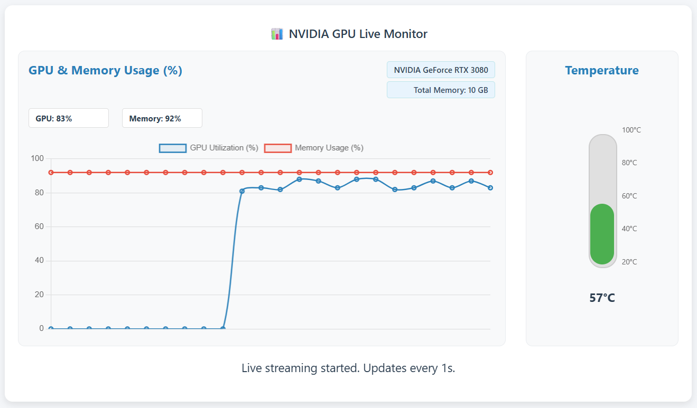

# TOPG - TOP for GPU (Nvidia GPU)
TOPG GPU Monitoring Server - Real-time GPU stats via WebSocket  



## How to compile the server

### On Linux/WSL2
Install dependencies using [vcpkg - (VC++ Package Manager)](https://vcpkg.io/en/index.html) 

```bash
# Clone this repository with recursive option
$ git clone  https://github.com/sukesh-ak/topg.git
$ cd topg

# Grab vcpkg
$ git clone https://github.com/microsoft/vcpkg.git

# Run the bootstrap script for vcpkg
$ ./vcpkg/bootstrap-vcpkg.sh
```

### Compile and Run
```bash
$ chmod +x build.sh
$ ./build.sh

# Run executable with CLI help
$ ./build/topg --help
```

## How to run the server
```bash
TOPG GPU Monitoring Server - Real-time GPU stats via WebSocket
Usage:
  topgsrv [OPTION...]

  -h, --host arg  Host address to bind to (default: 0.0.0.0)
  -p, --port arg  Port to listen on (default: 8080)
      --help      Print usage information
```

## Websocket Web UI Client for visualization
```python
# Run this from webui folder
python3 -m http.server 8081
```
