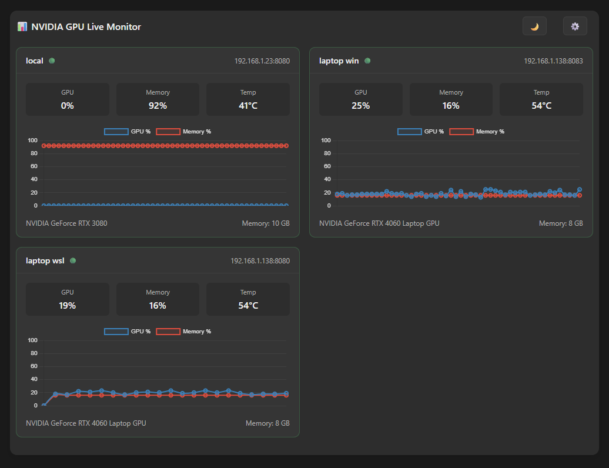
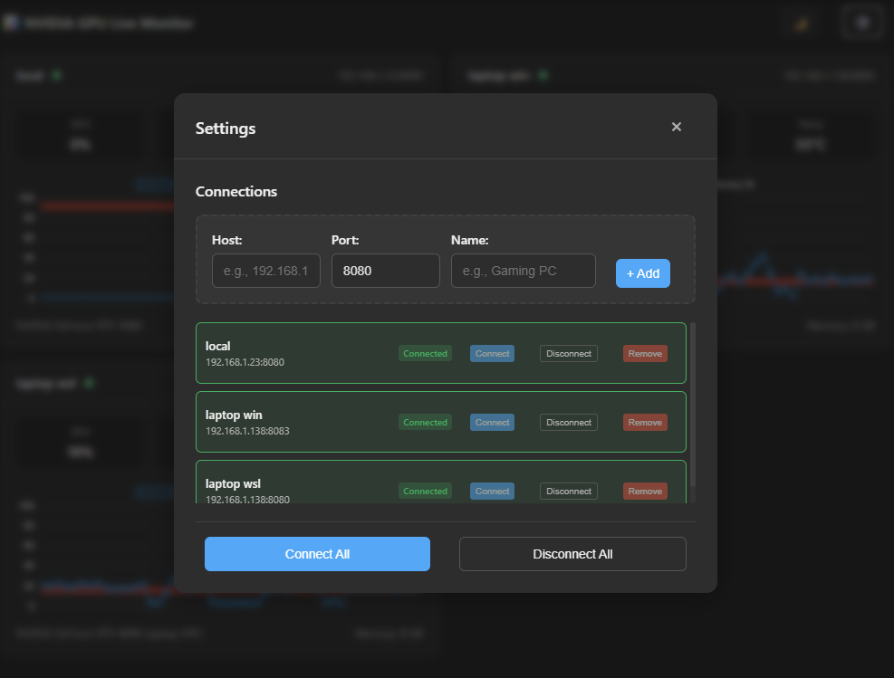

# TOPG - TOP for GPU (Nvidia GPU)
- TOPG GPU Monitoring Server - Real-time GPU stats via WebSocket.  
- Web UI with support for multiple websocket connection.

### Dashboard  


### Connection Settings  



## How to compile the server

### On Linux/WSL2/Windows
Install dependencies using [vcpkg - (VC++ Package Manager)](https://vcpkg.io/en/index.html) 

```bash
# Clone this repository 
$ git clone  https://github.com/sukesh-ak/topg.git
$ cd topg/server

# Grab vcpkg
$ git clone https://github.com/microsoft/vcpkg.git

# Run the bootstrap script for vcpkg
# Linux
$ ./vcpkg/bootstrap-vcpkg.sh  

# Windows
.\vcpkg\bootstrap-vcpkg.bat   
```

### Compile and Run
```bash
$ cmake . -B build -DCMAKE_TOOLCHAIN_FILE="vcpkg/scripts/buildsystems/vcpkg.cmake"
$ cmake --build build/

# Run executable with default parameters
# Linux
$ ./build/topg

# Windows
./build/debug/topg.exe
```

#### How to run the server with custom host and port settings
```bash
TOPG GPU Monitoring Server - Real-time GPU stats via WebSocket
Usage:
  topgsrv [OPTION...]

  -h, --host arg  Host address to bind to (default: 0.0.0.0)
  -p, --port arg  Port to listen on (default: 8080)
      --help      Print usage information
```

## Websocket Web UI Client for visualization

### Option 1: Using Docker (Recommended)
```bash
# Prerequisites: Install NVIDIA Container Toolkit for GPU access (for server only)
# https://docs.nvidia.com/datacenter/cloud-native/container-toolkit/latest/install-guide.html

# Option A: Run both server and webui together
$ docker compose up -d

# Option B: Run only the GPU server (requires GPU machine)
$ docker compose -f docker-compose.server.yml up -d

# Option C: Run only the webui (can run on any machine)
$ docker compose -f docker-compose.webui.yml up -d

# Services will be available at:
# - GPU Server: ws://localhost:8080 (WebSocket)
# - Web UI: http://localhost:8081

# View logs
$ docker compose logs -f

# To stop containers
$ docker compose down
# or for specific compose file:
$ docker compose -f docker-compose.server.yml down
```

**Docker Features:**
- Multi-stage build for optimized container size
- GPU server runs with NVIDIA Container Runtime for nvidia-smi access
- Non-root user for security
- Automatic dependency management with vcpkg
- Lightweight nginx serving for webui
- Separate compose files for flexible deployment (server-only, webui-only, or combined)
- Bridge networking for container communication

### Option 2: Manual Setup (Server + WebUI separately)
```bash
# First compile and run the server (see compilation instructions above)
$ ./build/topg

# Then in another terminal, run webui from webui folder
$ cd webui
$ python3 -m http.server 8081

# Or use any other web server to host the webui folder
```
